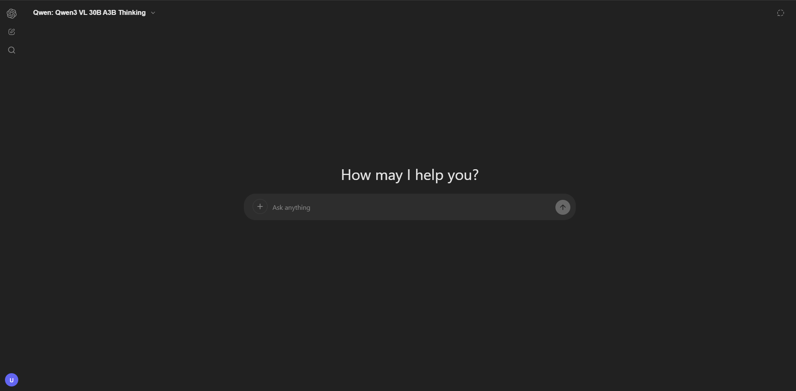
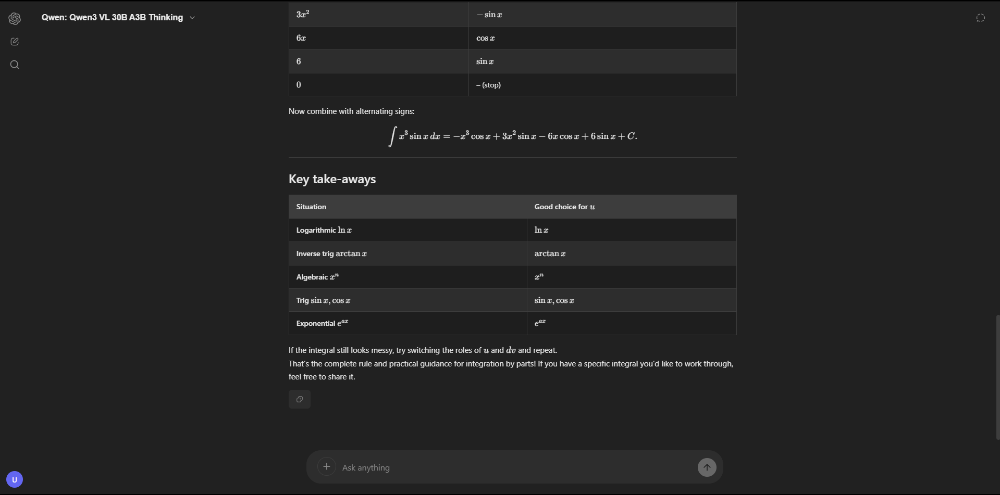
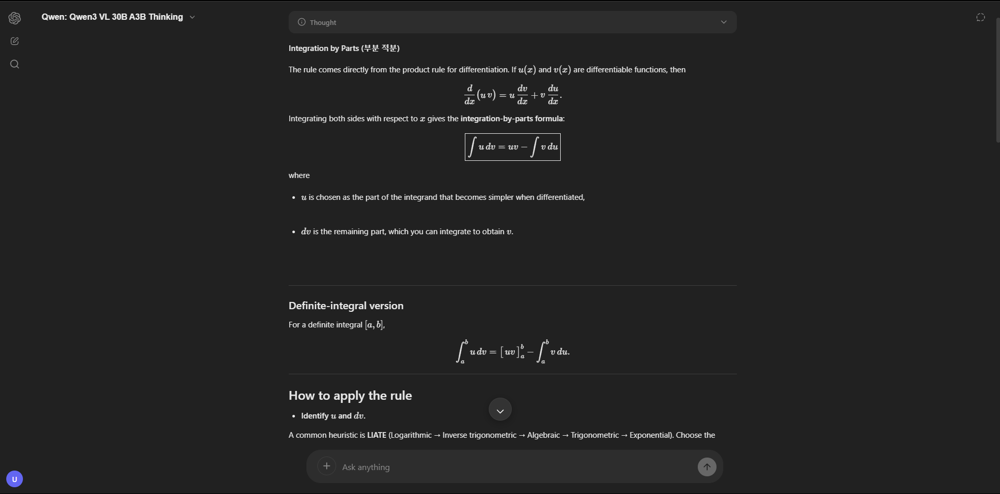
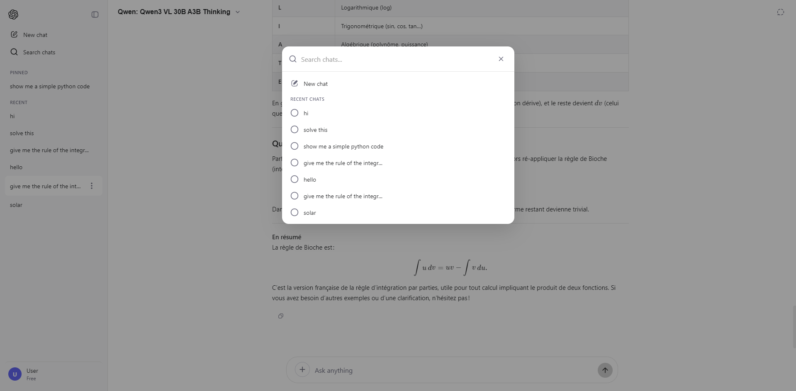

<div align="center">

# ✦ ChaqGPT

**A sleek, free AI chat interface powered by the world's best open-source models.**

[](https://vercel.com/import/project?template=https://github.com/Amer-alsayed/chaqgpt)
[](LICENSE)

[Live Demo](https://chaqgpt.vercel.app) · [Report Bug](https://github.com/Amer-alsayed/chaqgpt/issues) · [Request Feature](https://github.com/Amer-alsayed/chaqgpt/issues)

</div>

---

## 📸 Screenshots

<div align="center">

| Welcome Screen | Math & LaTeX Rendering |
|---|---|
|  |  |

| Thinking Visualization | Sidebar & Chat Search |
|---|---|
|  |  |

</div>

---

## ✨ Features

| Category | Details |
|---|---|
| **Multi-Model Access** | 30+ free models — Qwen3 VL, DeepSeek R1, Llama 3.3 70B, Gemma 3, Mistral, and more |
| **Vision Support** | Upload images and get AI analysis with vision-enabled models |
| **Thinking Visualization** | Watch reasoning models "think" in real-time with expandable thought chains |
| **Rich Rendering** | Full Markdown, LaTeX math (KaTeX), syntax-highlighted code blocks with copy |
| **Chat History** | Persistent conversations stored locally — pick up where you left off |
| **Dark & Light Themes** | Toggle between themes; follows system preference by default |
| **Temporary Chat** | One-off conversations that aren't saved to history |
| **Mobile Optimized** | Responsive design with keyboard-aware viewport handling |
| **Streaming Responses** | Token-by-token streaming with adaptive 60fps render queue |
| **Zero Framework** | Pure HTML/CSS/JS — fast, lightweight, no build step required |

---

## 🛠️ Tech Stack

- **Frontend** — Vanilla HTML, CSS, JavaScript (no framework overhead)
- **Backend** — Vercel Serverless Functions (Node.js)
- **AI Provider** — [OpenRouter](https://openrouter.ai) (free-tier models)
- **Rendering** — [Marked](https://marked.js.org) + [KaTeX](https://katex.org) + [Highlight.js](https://highlightjs.org)
- **Design** — Custom CSS with spring animations, glassmorphism, and safe-area support

---

## 🚀 Quick Start

### Prerequisites

- [Node.js](https://nodejs.org) 18+
- An [OpenRouter](https://openrouter.ai) API key (free)

### Local Development

```bash
# Clone the repo
git clone https://github.com/Amer-alsayed/chaqgpt.git
cd chaqgpt

# Install Vercel CLI
npm i -g vercel

# Create .env file with your API key
echo OPENROUTER_API_KEY=your_key_here > .env

# Start the dev server
vercel dev
```

The app will be available at `http://localhost:3000`.

---

## 📦 Deploy to Vercel

1. **Push** your code to GitHub
2. **Import** the repo in [Vercel](https://vercel.com/new)
3. **Add** the environment variable:
   | Variable | Value |
   |---|---|
   | `OPENROUTER_API_KEY` | Your OpenRouter API key |
4. **Deploy** — that's it!

> [!TIP]
> The app automatically fetches all available free models from OpenRouter at runtime. No config changes needed when new models are added.

---

## 🤖 Default Model

New users start with **Qwen3 VL 30B A3B Thinking** — a powerful vision + reasoning model. Users can switch models anytime via the header dropdown, and their preference is saved locally.

---

## 📁 Project Structure

```
chaqgpt/
├── api/
│   ├── chat.js          # Chat completion proxy (streaming)
│   └── models.js        # Fetches & filters free models from OpenRouter
├── assets/
│   ├── css/style.css    # Complete design system
│   └── js/
│       ├── app.js       # Core application logic
│       └── config.js    # Welcome messages & suggestion sets
├── index.html           # Single-page application entry
├── vercel.json          # Vercel deployment config
└── .env                 # API key (not committed)
```

---

## 🔒 Security

- API keys are **never** exposed to the client
- All API calls route through serverless functions
- `.env` is gitignored by default

---

## 📄 License

This project is licensed under the [MIT License](LICENSE).

---

<div align="center">
  <sub>Built with ☕ by <a href="https://github.com/Amer-alsayed">Amer Alsayed</a></sub>
</div>
