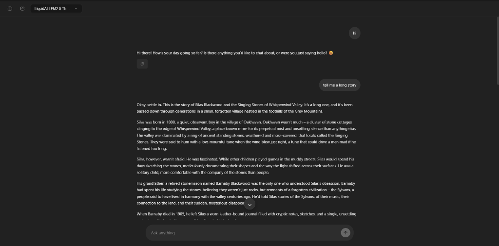

# ChaqGPT

**ChaqGPT** is a powerful, free-to-use AI chat interface that provides access to state-of-the-art open-source models including DeepSeek R1, Llama 3.3, Qwen, and more. It features a modern, responsive UI with advanced capabilities like reasoning visualization, code syntax highlighting, and persistent chat history.

 

## 🚀 Features

-   **Multi-Model Support**: Access to top-tier models via free APIs:
    -   **Reasoning**: DeepSeek R1T2 Chimera (Default), DeepSeek R1, GPT-OSS 120B.
    -   **General**: Llama 3.3 70B, Qwen, Mistral, Gemma 3.
    -   **Coding**: Qwen3 Coder, Mistral Devstral.
-   **Thinking Process Visualization**: Watch the AI "think" in real-time with expandable reasoning sections for models like DeepSeek R1.
-   **Adaptive Rendering**:
    -   **Sticky Scroll**: Robust "stick-to-bottom" logic that respects user reading.
    -   **Render Queue**: Smooth 60fps adaptive typing engine that handles fast token streams without lag.
-   **Developer Friendly**:
    -   Full Markdown & LaTeX (Math) support.
    -   Syntax highlighting for code blocks with one-click copy.
-   **User Experience**:
    -   Dark/Light theme toggle.
    -   Mobile-first responsive design.
    -   Local storage for chat history and settings.

## 🛠️ Tech Stack

-   **Frontend**: Vanilla HTML/CSS/JavaScript (No heavy framework overhead).
-   **Deployment**: Optimized for [Vercel](https://vercel.com).
-   **Styles**: Custom CSS with Apple-like spring animations and glassmorphism.

## 🚀 Getting Started

### Prerequisites

-   Node.js (for local dev/Vercel CLI).

### Local Development

1.  Clone the repository:
    ```bash
    git clone https://github.com/yourusername/chaqgpt.git
    cd chaqgpt
    ```

2.  Install Vercel CLI (optional, for emulation):
    ```bash
    npm i -g vercel
    ```

3.  Run locally:
    ```bash
    vercel dev
    ```
    Or simply open `index.html` in a browser (some API features may require a backend proxy if configured).


## 🤖 Default Model

The default model is currently set to **DeepSeek R1T2 Chimera**, a robust reasoning model that balances performance and language stability.

## 📄 License

[MIT](LICENSE)
