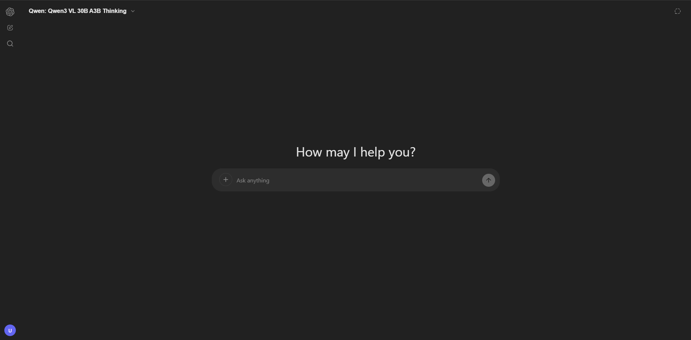
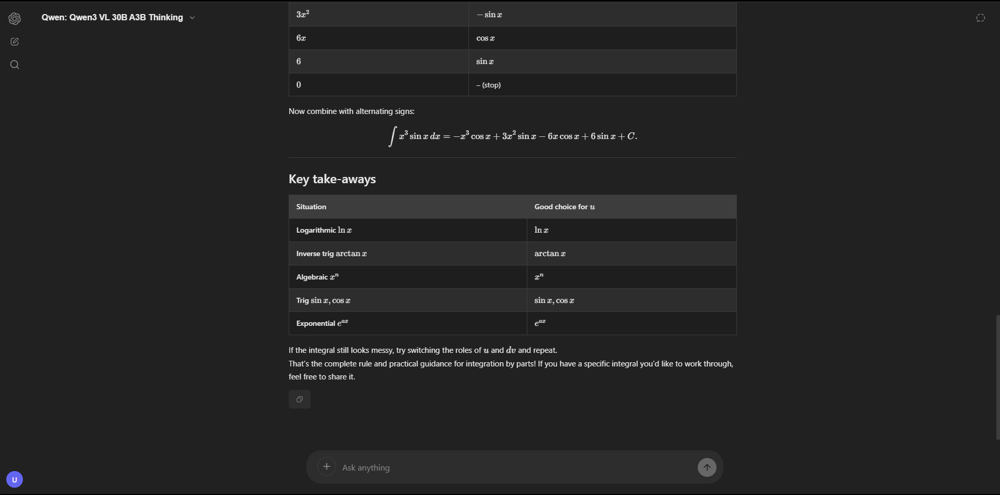
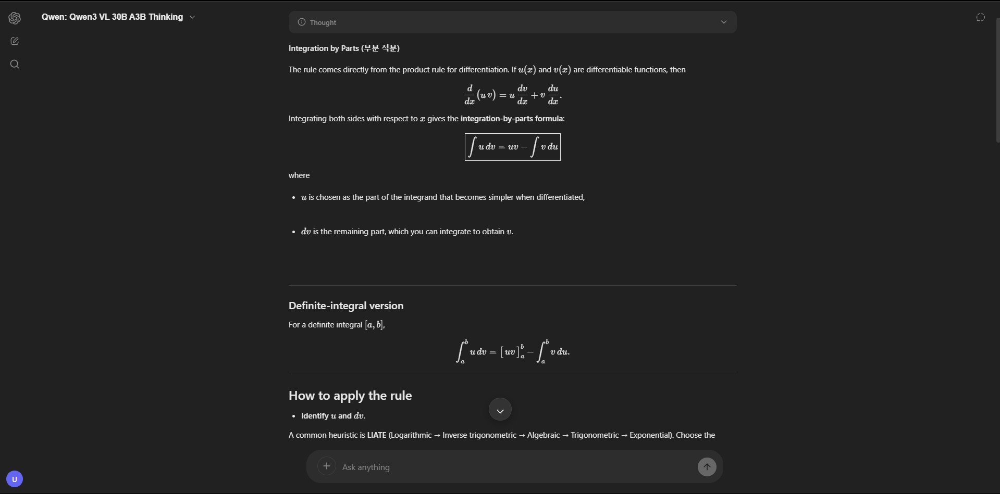
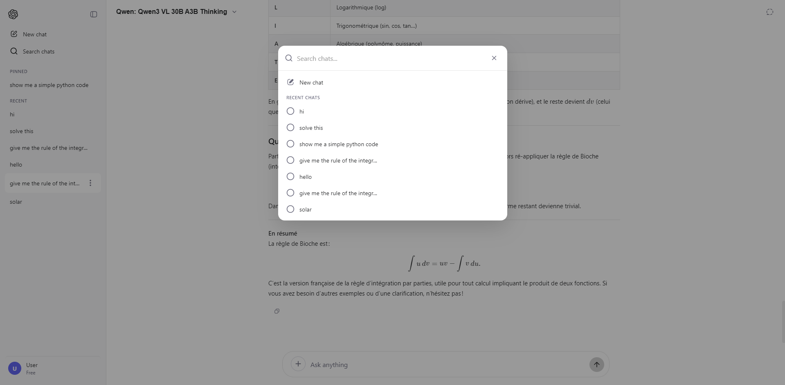

<div align="center">

# ChaqGPT

**A sleek, free AI chat interface powered by open-source models.**

[](https://vercel.com/import/project?template=https://github.com/Amer-alsayed/chaqgpt)
[](LICENSE)

[Live Demo](https://chaqgpt.vercel.app) · [Report Bug](https://github.com/Amer-alsayed/chaqgpt/issues) · [Request Feature](https://github.com/Amer-alsayed/chaqgpt/issues)

</div>

---

## Screenshots

### Welcome Screen


### Math & LaTeX Rendering


### Thinking Visualization


### Sidebar & Chat Search


---

## Features

| Category | Details |
|---|---|
| **Multi-Provider Models** | OpenRouter + Groq model catalog in one selector |
| **Free/Usable Filtering** | OpenRouter strict-free + Groq account-usable chat models |
| **Auto Refresh** | Model availability updates automatically with stale-cache fallback |
| **Dynamic Key Rotation** | Per-provider key failover, cooldowns, and retry classification |
| **Vision Support** | Upload images and analyze with vision-capable models |
| **Thinking Visualization** | Reasoning streams shown with expandable thought chains |
| **Rich Rendering** | Markdown, LaTeX (KaTeX), syntax-highlighted code blocks |
| **Chat History** | Persistent local conversation history |
| **Streaming Responses** | Token streaming with responsive UI updates |
| **Zero Framework** | Pure HTML/CSS/JS, no frontend build step |

---

## Tech Stack

- **Frontend** - Vanilla HTML, CSS, JavaScript
- **Backend** - Vercel Serverless Functions (Node.js)
- **AI Providers** - [OpenRouter](https://openrouter.ai) and [Groq](https://console.groq.com)
- **Rendering** - [Marked](https://marked.js.org), [KaTeX](https://katex.org), [Highlight.js](https://highlightjs.org)

---

## Quick Start

### Prerequisites

- [Node.js](https://nodejs.org) 18+
- OpenRouter API key(s)
- Groq API key(s)

### Local Development

```bash
# Clone the repo
git clone https://github.com/Amer-alsayed/chaqgpt.git
cd chaqgpt

# Install Vercel CLI
npm i -g vercel

# Create .env (JSON arrays are preferred)
echo OPENROUTER_API_KEYS_JSON='["sk-or-1","sk-or-2"]' > .env
echo OPENROUTER_API_KEY=your_openrouter_key >> .env

echo GROQ_API_KEYS_JSON='["gsk_1","gsk_2"]' >> .env
echo GROQ_API_KEY=your_groq_key >> .env

# Start dev server
vercel dev
```

The app will be available at `http://localhost:3000`.

---

## Environment Variables

| Variable | Purpose |
|---|---|
| `OPENROUTER_API_KEYS_JSON` | JSON array of OpenRouter keys (preferred) |
| `OPENROUTER_API_KEY` | Single OpenRouter key fallback |
| `OPENROUTER_API_KEYS_FILE` | Optional path to newline-delimited OpenRouter keys file |
| `OPENROUTER_KEY_COOLDOWN_RATE_LIMIT_MS` | Optional, default `900000` |
| `OPENROUTER_KEY_COOLDOWN_AUTH_MS` | Optional, default `21600000` |
| `OPENROUTER_KEY_COOLDOWN_TRANSIENT_MS` | Optional, default `30000` |
| `OPENROUTER_MAX_FAILOVER_ATTEMPTS` | Optional, default `10` |
| `GROQ_API_KEYS_JSON` | JSON array of Groq keys (preferred) |
| `GROQ_API_KEY` | Single Groq key fallback |
| `GROQ_API_KEYS_FILE` | Optional path to newline-delimited Groq keys file |
| `GROQ_KEY_COOLDOWN_RATE_LIMIT_MS` | Optional, default `900000` |
| `GROQ_KEY_COOLDOWN_AUTH_MS` | Optional, default `21600000` |
| `GROQ_KEY_COOLDOWN_TRANSIENT_MS` | Optional, default `30000` |
| `GROQ_MAX_FAILOVER_ATTEMPTS` | Optional, default `10` |
| `GROQ_MODEL_PROBE_CONCURRENCY` | Optional, default `4` |
| `GROQ_MODEL_PROBE_MAX_ATTEMPTS` | Optional, default `2` |

> The app auto-refreshes model lists. OpenRouter models are filtered to strict-free pricing; Groq models are filtered to chat-usable models for your keys.

---

## Project Structure

```text
chaqgpt/
├── api/
│   ├── chat.js
│   ├── image.js
│   ├── models.js
│   └── lib/
│       ├── model-catalog.js
│       ├── openrouter-models.js
│       ├── groq-models.js
│       ├── provider-key-pool.js
│       ├── openrouter-key-pool.js
│       └── groq-key-pool.js
├── assets/
│   ├── css/style.css
│   └── js/app.js
├── index.html
├── server.js
└── README.md
```

---

## Security

- API keys are never exposed to the browser.
- Provider calls are proxied through server-side handlers.
- `.env` is ignored by git.

---

## License

This project is licensed under the [MIT License](LICENSE).
